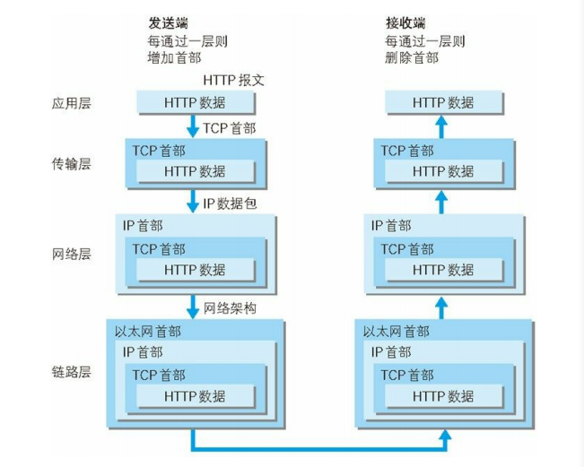

# 1.2 TCP/IP

通常使用的网络（包括互联网）是在 `TCP/IP` 协议族的基础上运作的。而 `HTTP` 属于它内部的一个子集。所以为了理解 `HTTP`，我们有必要事先了解一下 TCP/IP 协议族

`TCP` 为 `HTTP` 提供了一条可靠的比特传输管道。从 `TCP` 连接一端填入的字节会从另一端以原有的顺序、正确地传送出来。

## 1.2.1 TCP/IP 的分层管理

`TCP/IP` 协议族按层次分别分为以下 4 层：应用层、传输层、网络层和数据链路层。

>**分层好处**：层次化之后，设计也变得相对简单了。处于应用层上的应用可以只考虑分派给自己的任务，而不需要弄清对方在地球上哪个地方、对方的传输路线是怎样的、是否能确保传输送达等问题。

`TCP/IP` 协议族各层的作用如下:

- **应用层**: 应用层决定了向用户提供应用服务时通信的活动。
  `TCP/IP` 协议族内预存了各类通用的应用服务。比如，`FTP`（`File Transfer Protocol`，文件传输协议）和 `DNS`（`Domain Name System`，域名系统）服务就是其中两类以及`http`。
  
- **传输层**: 提供处于网络连接中的两台计算机之间的数据传输。
  在传输层有两个性质不同的协议：`TCP`（`Transmission Control Protocol`，传输控制协议）和 `UDP`（`User Data Protocol`，用户数据报协议）。

- **网络层**: 网络层用来处理在网络上流动的数据包。数据包是网络传输的最小数据单位。该层规定了通过怎样的路径（所谓的传输路线）到达对方计算机，并把数据包传送给对方。(`ip`协议)
  与对方计算机之间通过多台计算机或网络设备进行传输时，网络层所起的作用就是在众多的选项内选择一条传输路线。

- **数据链路层**: 用来处理连接网络的硬件部分。
  包括控制操作系统、硬件的设备驱动、`NIC`（`Network Interface Card`，网络适配器，即网卡），及光纤等物理可见部分（还包括连接器等一切传输媒介）。硬件上的范畴均在链路层的作用范围之内。

## 1.2.2 TCP/IP通信传输流

>`HTTP` 要传送一条报文时，会以流的形式将报文数据的内容通过一条打开的 `TCP` 连接按序传输。`TCP` 收到数据流之后，会将数据流砍成被称作段的小数据块，并将段封装在 `IP` 分组中，通过因特网进行传输。所有这些工作都是由 `TCP/ IP` 软件来处理的，`HTTP` 程序员什么都看不到。
>每个 `TCP` 段都是由 `IP` 分组承载，从一个 `IP` 地址发送到另一个 `IP` 地址的。每个 `IP` 分组中都包括： 
>- 一个 `IP` 分组首部（通常为 20 字节）； 
>- 一个 `TCP` 段首部（通常为 20 字节）；
>- 一个 `TCP` 数据块（0 个或多个字节）。 

## 1.2.3 TCP协议

按层次分，`TCP` 位于传输层，提供可靠的字节流服务。

所谓的字节流服务是指为了方便传输，将大块数据分割成以报文段为单位的数据包进行管理。而可靠的传输服务是指，能够把数据准确可靠地传给对方。

为了准确无误地将数据送达目标处，`TCP` 协议采用了三次握手策略。

- 第一次：发送端首先发送一个带 `SYN` 标志的数据包给对方。
- 第二次：接收端收到后，回传一个带有 `SYN/ACK` 标志的数据包以示传达确认信息。
- 第三次：发送端再回传一个带 `ACK` 标志的数据包。

> 若在握手过程中某个阶段莫名中断，`TCP` 协议会再次以相同的顺序发送相同的数据包。

## 1.2.3 IP协议

`IP` 协议的作用是把各种数据包传送给对方。而要保证确实传送到对方那里，则需要满足各类条件。其中两个重要的条件是 `IP` 地址和 `MAC` 地址。

`IP` 地址指明了节点被分配到的地址，`MAC` 地址是指网卡所属的固定地址。`IP` 地址可以和 `MAC` 地址进行配对。`IP` 地址可变换，但 `MAC` 地址基本上不会更改。

### 1.2.4 DNS服务
`DNS`（`Domain Name System`）服务是和 `HTTP` 协议一样位于应用层的协议。它提供域名到 `IP` 地址之间的解析服务。

