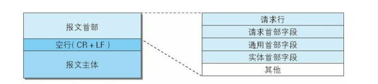
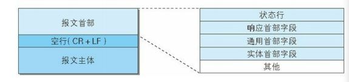

# 2.2 http报文

用于 `HTTP` 协议交互的信息被称为 `HTTP` 报文。请求端（客户端）的 `HTTP` 报文叫做请求报文，响应端（服务器端）的叫做响应报文。 `HTTP` 报文本身是由多行（用 `CR+LF` 作换行符）数据构成的字符串文本。

`HTTP` 报文大致可分为报文首部和报文主体两块。两者由最初出现的空行（`CR+LF`）来划分。通常，并不一定要有报文主体。

## 2.2.1 请求报文

一个HTTP请求报文由请求行（`request line`）、请求头部（`header`）、空行和请求数据4个部分组成。

- 请求行：
  请求行由请求方法字段、`URL`字段和`HTTP`协议版本字段3个字段组成。
- 请求头部：
  请求头部由关键字/值对组成，每行一对，关键字和值用英文冒号“:”分隔。请求头部通知服务器有关于客户端请求的信息。
- 空行：
- 请求数据：
  含了所有类型的数据。请求主体中包括了要发送给 `Web` 服务器的数据；响应主体中装载了要返回给客户端的数据。起始行和首部都是文本形式且都是结构化的，而主体则不同，主体中可以包含任意的二进制数据（比如图片、视频、音轨、软件程序）。当然，主体中也可以包含文本。

## 2.2.2 响应报文

`HTTP`响应也由4个部分组成，分别是：状态行、响应头部、空行、响应正文（实体）。

- 响应行：
  响应行由`HTTP`版本号，状态码和状态值组成。
- 响应头部：
  响应头部也是由关键字/值对组成，每行一对，关键字和值用英文冒号“:”分隔。
- 空行：
- 响应正文：
  包含了`Web`客户端请求的对象。